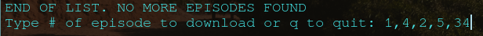
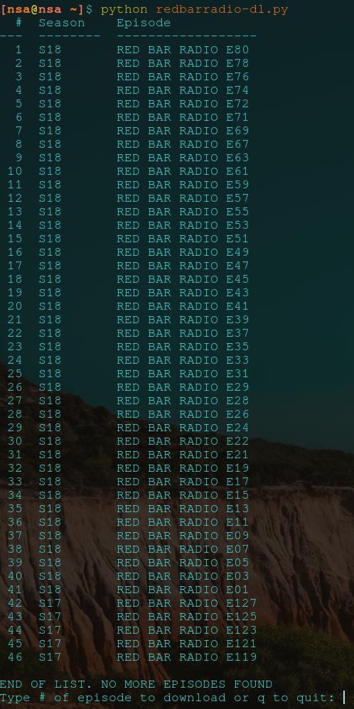

# Download free redbarradio episodes in terminal

## Usage

### Run script with:
  ```
  python redbarradio-dl.py  
  ```

### Change video and archive file location in settings.py
``` python
DOWNLOAD_PATH = "your path here"
ARCHIVE_PATH = "your path here"
```

### To download multiple videos use '-'


### To download specific videos use comma ','


### Preview


## Install requirements with:
```
pip install -r requirements.txt
```
